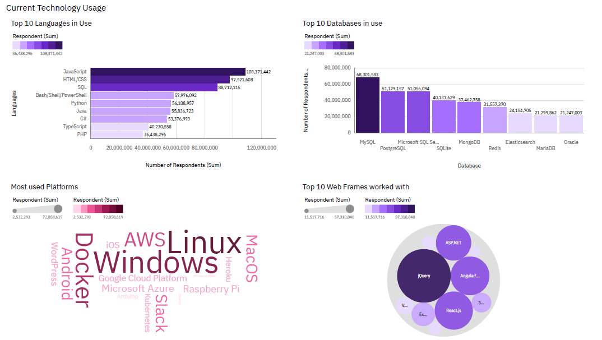
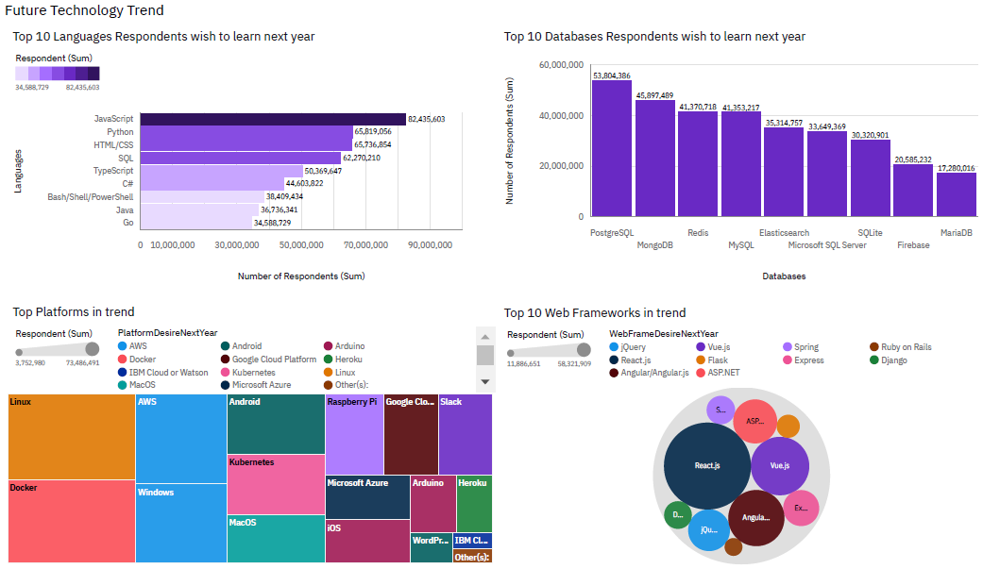
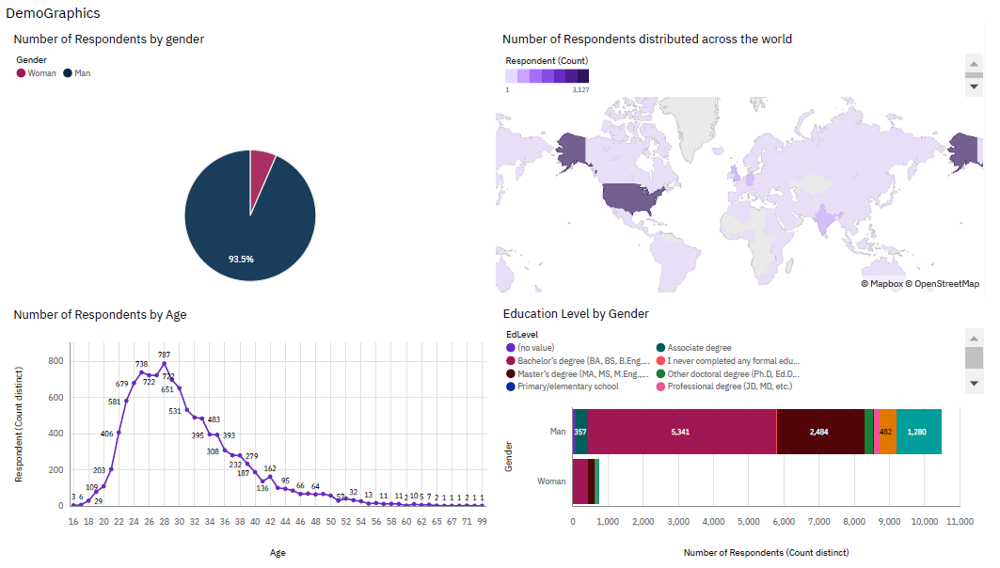

# IBM Data Analyst Capstone Project

## Project Title: Analyzing IT Skills Trends and Professional Demographics

## Table of Contents
- [Introduction](#introduction)
- [Project Structure](#project-structure)
- [Data Collection](#data-collection)
- [Data Processing](#data-processing)
- [Visuals](#visuals)
- [Key Findings](#key-findings)
- [Recommendations](#recommendations)
- [Conclusion](#conclusion)

### Introduction
To be competitive in the global IT sector, it’s essential to keep up with the ever-changing technologies. This project utilizes data analytics to highlight current and projected trends in the demand for skills related to programming languages, databases, and other technologies. It also examines the demographics of professionals in the technology sector.

### Project Structure
- **data/**: Contains raw and processed datasets.
- **notebooks/**: Jupyter notebooks for data cleaning, analysis, and visualization.
- **reports/**: Generated reports and presentations using COGNOS and Powerpoint
- **README.md**: Project overview and setup instructions.

### Data Collection
Data for this project was gathered from:
- Stack Overflow Survey
- IBM Site

### Data Processing
1. **Data Collection**: Aggregated data from multiple sources.
2. **Data Cleaning**: Removed duplicates, handled missing values, and standardized formats.
3. **Exploratory Data Analysis (EDA)**: Identified patterns, trends, and key insights.
4. **Visualization**: Created dashboards to visualize data trends and findings.

### Visuals

*Figure 1: Current Trend*

*Figure 2: Future Trend*

*Figure 3: Demographics*

### Key Findings
- **Programming Languages**: JavaScript is currently the most popular programming language and is anticipated to remain dominant in the future.
- **Database Usage**: MySQL has the highest usage currently, but PostgreSQL is projected to see increased demand.
- **Demographics**: The majority of survey respondents are males, predominantly from the USA, with an average age of 28 years.

### Recommendations
Based on the analysis, the following recommendations are made:
- **Skill Development**: Focus on learning JavaScript and PostgreSQL to align with future market demands.
- **Training Programs**: Develop training programs targeting the most popular and in-demand technologies.
- **Diversity Initiatives**: Implement strategies to diversify the demographic profile of IT professionals.

### Conclusion
This project provides valuable insights into the current and future trends in IT skills and professional demographics. By focusing on the most in-demand technologies and implementing strategic training and diversity initiatives, organizations can better align their workforce with market needs and enhance their competitive edge in the global IT sector.